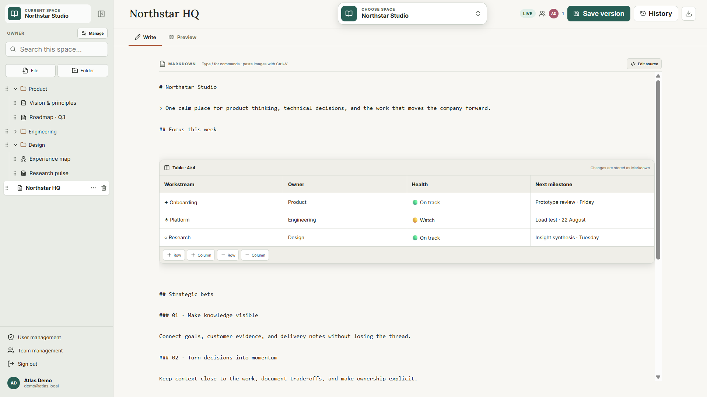
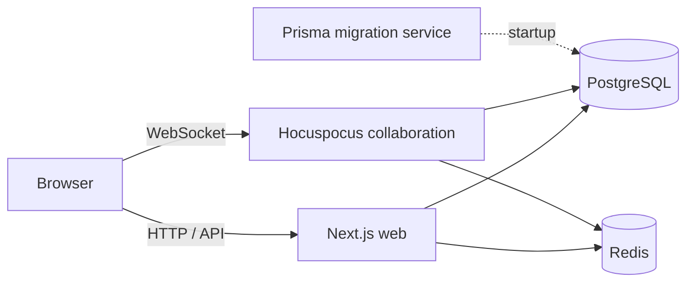

<div align="center">

# Atlas Docs

**Collaborative knowledge work, self-hosted.**


Write in Markdown and LaTeX, sketch in standalone Excalidraw canvases, organize
everything in permission-aware spaces, and keep your content portable.

[Why Atlas Docs](#why-atlas-docs) &middot; [Features](#features) &middot;
[Security](#security-and-privacy) &middot; [Architecture](#architecture) &middot;
[Quick start](#quick-start) &middot; [Setup guide](SETUP.md)

</div>



<p align="center"><sub>A real local demo space with documents, visual tables, nested organization, and a standalone canvas.</sub></p>

> This README follows the repository source. Features newer than the selected
> `ATLAS_VERSION` require a local source build until a matching release is tagged.

## Why Atlas Docs

Atlas Docs brings documents, scientific writing, and visual thinking into one
real-time workspace that runs on infrastructure you control. It is designed for
teams that want collaborative editing without giving up portable source formats
or a straightforward Docker-based operating model.

| Product principle | What it means |
| --- | --- |
| **Portable by default** | Markdown, LaTeX, standard `.excalidraw` files, source downloads, and portable ZIP exports keep content useful outside the application. |
| **Built for live work** | Yjs and Hocuspocus synchronize text and canvases, while presence and cursors make active collaborators visible. |
| **Organized for teams** | Spaces, nested folders, teams, direct grants, and `OWNER` / `EDITOR` / `VIEWER` roles keep knowledge structured. |
| **Operated by you** | Docker Compose, PostgreSQL backups, local browser assets, pinned infrastructure images, and offline deployment options support self-managed installations. |

## Features

### Documents and visual files

- Real-time Markdown and LaTeX editing with previews and source-file downloads.
- Standalone, collaboratively edited Excalidraw canvas files.
- Hybrid GFM table editing with row and column controls that keeps the persisted
  document as Markdown.
- Slash commands for tables, code blocks, images, headings, lists, quotes,
  dividers, and links.
- Clipboard image paste, automatic list continuation, text indentation, and
  keyboard navigation for visual table cells.
- Manual, format-specific versions for restoring document text or canvas state.

### Collaboration and organization

- Live collaborator presence and cursors across document sessions.
- Spaces with cover images, nested folders, drag-and-drop ordering, and
  file/folder-name search.
- Page and canvas deletion, folder management, and owner/admin space renaming or
  deletion with explicit confirmation.
- Direct user access and team-based access, including expiring team membership.
- Page-specific live links with `VIEW` or content-only `EDIT` access, optional
  expiry, and immediate revocation. A link exposes its page, not the containing
  space, folders, history, or permission administration.
- Searchable, keyboard-accessible space switching from the editor.

### Identity and personalization

- Local accounts, generic OpenID Connect, or both authentication methods at once.
- Administrator interfaces for users and teams.
- English and German interfaces.
- Per-user theme, interface and editor fonts, text size, compact navigation, and
  profile image preferences.

### Portability and operations

- User-scoped and administrator instance-wide emergency ZIP snapshots for
  Obsidian or VS Code. They export the latest PostgreSQL-persisted content and
  record flush or per-page conversion problems as warnings/error files; they do
  not contain accounts, permissions, sessions, or version history.
- PostgreSQL backup tooling with validation, checksums, optional `age`
  encryption, retention, and a dedicated upgrade tier that retains page-version
  history.
- Docker Hub, GHCR, internal registry, and physically disconnected deployment
  paths.
- Additive migration from legacy embedded canvases to standalone canvas files.

## Security and privacy

The core Atlas Docs stack is self-hosted and does not require public internet
access at runtime. Browser assets, including Excalidraw assets and LaTeX fonts,
are served by the web container. A configured OIDC provider must remain
reachable, and external resources deliberately referenced in user-authored
content can still be requested by the reader's browser.

- Durable application data lives in PostgreSQL; Redis carries rebuildable
  collaboration and login-rate-limit state.
- Local passwords are bcrypt-hashed. Collaboration connections use signed,
  page-scoped tokens that also carry read-only state.
- Page-share secrets are generated from cryptographically random bytes and only
  their SHA-256 hashes are stored. Only space owners and instance
  administrators can create, change, or revoke them.
- Public page links are bearer credentials: anyone holding one receives its
  configured access until it expires or is revoked. Shared pages use
  `noindex`, `nofollow`, `noarchive`, and a no-referrer policy, but operators
  should still use HTTPS and avoid recording `/share/` paths in analytics or
  long-lived proxy logs.
- Uploaded page images share the page authorization model, are checked by file
  signature, are limited to 5 MB, and are removed with their page.
- Atlas application containers run as a non-root user. Compose drops Linux
  capabilities and enables `no-new-privileges` for the web, collaboration, and
  migration services.
- Permissions can be granted directly or through teams; the strongest active
  grant applies, and expired team memberships provide no access.

| Space role | Read | Edit content | Manage space and permissions |
| --- | :---: | :---: | :---: |
| `VIEWER` | Yes | No | No |
| `EDITOR` | Yes | Yes | No |
| `OWNER` | Yes | Yes | Yes |

Page links share the current live document rather than creating a detached
snapshot. `EDIT` links can modify Markdown, LaTeX, or canvas content, but cannot
rename the page, upload images, manage versions, browse the space, or change
permissions. See [page-specific share links](SETUP.md#page-specific-share-links)
for the threat model and operating guidance.

TLS, DNS, firewall policy, load balancing, and edge routing are intentionally
left to the server administrator. See [deployment and configuration](SETUP.md)
before exposing an installation outside a trusted network.

## Architecture



| Layer | Repository implementation |
| --- | --- |
| Web application | Next.js 15, React 19, NextAuth, Prisma API routes |
| Collaborative data | Yjs documents with Hocuspocus and Redis coordination |
| Editors | React Markdown/GFM, LaTeX.js, and Excalidraw |
| Persistence | PostgreSQL 17 for content, accounts, permissions, images, and versions |
| Deployment | Docker Compose with separate `web`, `collab`, and one-shot `migrate` images |

The default stack also starts PostgreSQL and Redis. The migration service applies
the Prisma schema, migrates legacy canvas data when needed, and seeds the initial
administrator before the application services start.

## Quick start

Production deployment requires a Linux host with Docker Engine and the Docker
Compose plugin. Read the [complete setup guide](SETUP.md) before starting; it
lists the required secrets, network settings, and production checks.

```bash
ATLAS_RELEASE=v1.5.1 # Replace with the published tag you intend to deploy.
git clone --branch "$ATLAS_RELEASE" --depth 1 https://github.com/Timo348/Atlas-Docs.git
cd Atlas-Docs
cp .env.example .env
editor .env
docker compose pull
docker compose up -d --no-build
docker compose ps
```

With the default ports, open `http://SERVER_IP:30002`. The browser must also be
able to reach the collaboration port, `30003` by default.

The release tag, its Compose files, and its `ATLAS_VERSION` must match. Do not
combine `main` with images from an older release. To evaluate newer, untagged
code from `main`, use a separate checkout, configure its `.env`, and build all
three Atlas images locally instead:

```bash
git clone --branch main https://github.com/Timo348/Atlas-Docs.git Atlas-Docs-main
cd Atlas-Docs-main
cp .env.example .env
editor .env
docker compose -f compose.yml -f compose.build.yml up -d --build
```

## Upgrades and backups

- Back up the installation before every upgrade, then pull and start the release
  selected by `ATLAS_VERSION`.
- Installations upgrading from embedded canvases must use the history-preserving
  `upgrade` backup tier before the one-time migration.
- Routine and archive backups are created by `backup.sh`; portable ZIP exports
  are available from the user profile inside Atlas Docs.

See [upgrading](SETUP.md#upgrading),
[backup and restore](SETUP.md#backup-and-restore), and
[portable application export](SETUP.md#portable-application-export) for the
operational procedures.

## Documentation and links

- [Setup, configuration, upgrades, backup, and development](SETUP.md)
- [Environment variable template](.env.example)
- [Version tags](https://github.com/Timo348/Atlas-Docs/tags)
- [Issue tracker](https://github.com/Timo348/Atlas-Docs/issues)
- [Docker Hub: web](https://hub.docker.com/r/timo348/atlas-docs-web)
- [Docker Hub: collaboration](https://hub.docker.com/r/timo348/atlas-docs-collab)
- [Docker Hub: migrations](https://hub.docker.com/r/timo348/atlas-docs-migrate)
- GHCR images: `ghcr.io/timo348/atlas-docs-web`,
  `ghcr.io/timo348/atlas-docs-collab`, and
  `ghcr.io/timo348/atlas-docs-migrate`

## License

Atlas Docs is licensed under the [Apache License 2.0](LICENSE).
